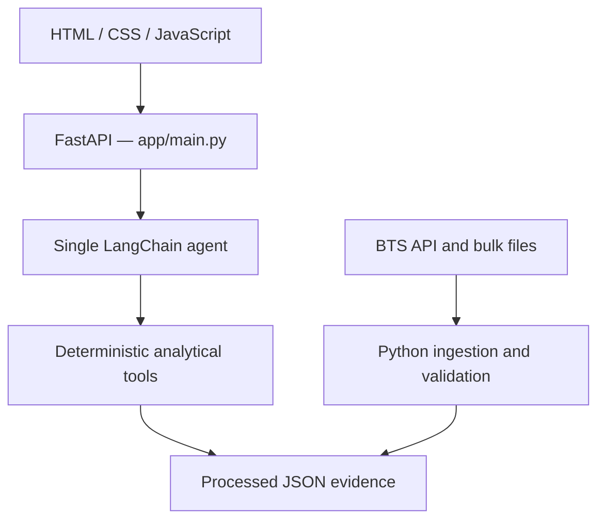

# Airport Investment Intelligence Agent — Design

## Overview

This project is a decision-support prototype for analysts screening U.S.
airports for modernization opportunities. It combines official public aviation
data, deterministic Python analytics, and a conversational Gemini agent.

The system supports:

1. New England terminal-expansion screening.
2. LAX/SNA operational-congestion comparison.
3. ANC long-haul departure percentage.
4. SFO demand-pressure analysis.

It does not calculate profitability, IRR, construction cost, or direct terminal
capacity. Its purpose is to identify evidence that merits deeper human review.

## Architecture



- `frontend/` contains the lightweight web chat.
- `app/main.py` exposes the backend application.
- `app/agent.py` manages Gemini, conversation state, HITL, and fallback.
- `app/airport_tools.py` exposes four read-only business capabilities.
- `scripts/` retrieves and processes source data.
- `data/processed/` contains reproducible evidence used by the demo.

The API key remains on the backend and is never exposed to browser code.

## Data sources

- **BTS T-100 Segment Summary API:** passengers, seats, departures, load factor,
  and year-over-year comparison.
- **BTS T-100 Segment bulk data:** route distance, service class, scheduled and
  performed departures.
- **BTS On-Time Performance:** delays, taxi-out, cancellations, diversions, and
  delay causes.

The API is used for selective summary retrieval. Official bulk files are used
for large route-level and flight-level datasets. Processed outputs are cached so
the demo remains reproducible if a source is temporarily unavailable.

## Scoring and deterministic methodology

All percentages, rankings, and classifications are calculated in Python, not
by the LLM.

### New England opportunity score

The cohort is BOS, BDL, PVD, MHT, PWM, BTV, ORH, and HVN.

```text
Opportunity Score =
    40% passenger-growth percentile
    + 40% weighted-load-factor percentile
    + 20% passenger-scale percentile
```

Passenger scale is log-transformed before tie-aware percentile ranking. Two
complete periods are compared: May 2024–April 2025 and May 2025–April 2026.
Current leaders are PWM (74.28), HVN (60.00), and BTV (57.14).

The score is a relative screening tool, not proof of terminal crowding or
profitability.

### ANC long-haul percentage

Long-haul is defined as a nonstop segment of at least 3,000 statute miles from
ANC. Only service class `F` is included, and the calculation is weighted by
`DEPARTURES_PERFORMED`.

```text
long_haul_percentage = long_haul_departures / all_departures * 100
```

Result for May 2025–April 2026: `1,023 / 35,415 = 2.89%`.

### LAX/SNA congestion

The comparison uses separate operational KPIs:

- departure-delay rate;
- average departure-delay minutes;
- average taxi-out minutes;
- cancellation and diversion rates;
- delay-cause mix and flight volume.

No overall congestion winner is declared because no composite congestion score
is defined. LAX has longer taxi-out and greater absolute operational scale;
SNA has slightly higher delay and cancellation rates.

### SFO demand pressure

Direct unmet-passenger demand is not available in the public data. The tool
therefore evaluates three transparent proxy signals:

1. weighted load factor is at least 80%;
2. passenger growth exceeds seat growth;
3. scheduled-service shortfall is at least 1%.

Three signals produce `strong`, one or two produce `moderate`, and zero produces
`limited`. SFO activates two signals and is classified as `moderate`. Scheduled
departures not operated are not equivalent to passengers with unmet demand.

## Where AI is used

The LLM:

- understands the user's intent;
- selects the correct analytical tool;
- maintains follow-up context;
- explains deterministic evidence in business language;
- communicates assumptions, source, period, and uncertainty.

The LLM does not calculate metrics, access arbitrary files, invent unsupported
airport data, or approve investments.

LangChain `create_agent` is used with Google Gemini and thread-scoped in-memory
conversation state. A single agent is sufficient for this small set of tools;
multi-agent coordination would add unnecessary complexity and latency.

## Human in the Loop

Routine read-only calculations run automatically. Material ambiguity requires
human clarification. For example, “LA airport” is intercepted before any model
or tool call. The request is stored by `thread_id` and resumes only after the
user specifies the airport.

Changes to scoring assumptions are not performed silently. A human must approve
the change and the deterministic calculation must be updated before a new
ranking is produced.

## Reliability and security

- Processed-file schemas, required columns, periods, and numeric values are
  validated.
- Gemini calls use bounded retries and timeouts.
- `GOOGLE_FALLBACK_API_KEY` enables a secondary Gemini client through
  `ModelFallbackMiddleware`.
- Gemini quotas are project-scoped; a second key in the same project is not
  meaningful quota redundancy.
- `.env`, `.venv`, raw data, and Python caches are excluded from Git.
- All tools are read-only and have no external side effects.

## Testing

The project has 32 passing automated tests covering data validation,
calculations, weighting, ranking, zero denominators, tool contracts, missing
credentials, conversation state, guardrails, fallback configuration, and HITL
pause/resume.

Credentialed acceptance tests cover all four assignment questions, follow-up
questions, Hebrew responses, unsupported scope, refusal to invent IRR, refusal
to silently change score weights, and cautious congestion interpretation.

## Key tradeoffs

- **Depth over breadth:** a small supported scope with traceable evidence rather
  than shallow answers about arbitrary airports.
- **API plus bulk data:** selective live retrieval where practical and official
  bulk files where datasets are large.
- **Cached evidence:** reproducible demos at the cost of requiring an explicit
  refresh step for newer data.
- **Explainability over one universal score:** New England uses a documented
  score; LAX/SNA exposes separate KPIs because they conflict.
- **Simple web UI:** HTML, CSS, and JavaScript are sufficient for a single chat
  screen and avoid unnecessary frontend framework overhead.

## Limitations

Operational delays do not directly prove terminal crowding. Load factor does
not prove unmet airport demand. Investment decisions require additional
terminal-capacity, engineering, regulatory, cost, revenue, and financing data.

A production version would add durable state, scheduled data refresh,
observability, authentication, persistent storage, CI/CD, and containerized
deployment.
